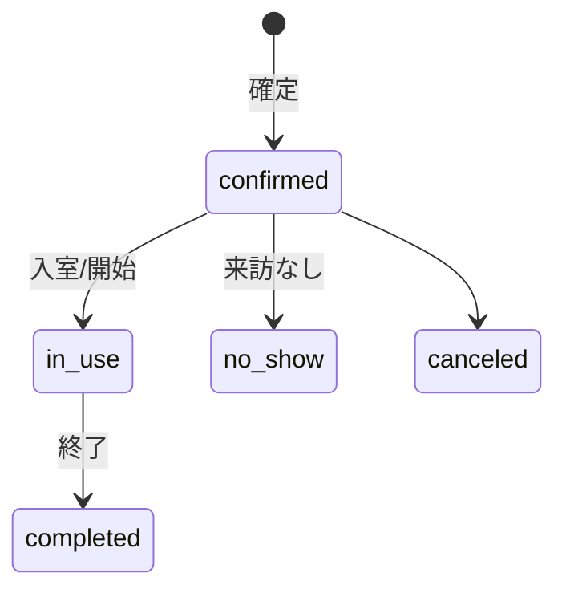

# reservations テーブル定義書

## 概要
- **テーブル名**: `public.reservations`
- **目的**: 予約情報を管理。部屋・サービス・顧客・担当・占有時間帯を保持。
- **主な利用画面/API**: 予約作成/更新、空き確認、ダッシュボード。
- **関連（ER）**:
  - `tenants(1) ─ (N) reservations`
  - `rooms(1) ─ (N) reservations`
  - `services(1) ─ (N) reservations`
  - `customers(1) ─ (N) reservations`
  - `staff(1) ─ (N) reservations`
  - `reservations(1) ─ (N) reservation_equipment_items`
  - `reservations(1) ─ (N) messages`

---

## カラム定義

| カラム名 | 型 | 必須 | デフォルト | 説明 | 制約 |
| --- | --- | :-: | --- | --- | --- |
| `id` | `uuid` | ✔︎ | `gen_random_uuid()` | 予約ID | `primary key` |
| `tenant_id` | `uuid` | ✔︎ |  | 所属テナント | `references tenants(id) on delete cascade` |
| `customer_id` | `uuid` |  |  | 顧客 | `references customers(id) on delete set null` |
| `service_id` | `uuid` |  |  | サービス | `references services(id) on delete set null` |
| `room_id` | `uuid` | ✔︎ |  | 対象部屋 | `references rooms(id) on delete restrict` |
| `staff_id` | `uuid` |  |  | 担当 | `references staff(id) on delete set null` |
| `start_at` | `timestamptz` | ✔︎ |  | 開始 |  |
| `end_at` | `timestamptz` | ✔︎ |  | 終了 |  |
| `status` | `text` | ✔︎ | `'confirmed'` | 予約状態 | `check (status in ('confirmed','in_use','completed','no_show','canceled'))` |
| `buffer_before_min` | `int` | ✔︎ | `0` | 前バッファ（分） |  |
| `buffer_after_min` | `int` | ✔︎ | `0` | 後バッファ（分） |  |
| `note` | `text` |  |  | 備考 |  |
| `created_by` | `uuid` |  |  | 作成者 | `references auth.users(id) on delete set null` |
| `updated_at` | `timestamptz` | ✔︎ | `now()` | 更新時刻 |  |
| `version` | `int` | ✔︎ | `1` | 将来の楽観ロック等 |  |
| `time_range` | `tstzrange` |  |  | 占有範囲（生成列） | status が占有時のみ `[start-buffer, end+buffer)` |

---

## インデックス/制約
- `idx_reservations_tenant_start (tenant_id, start_at)`
- `idx_reservations_room_start (room_id, start_at)`
- EXCLUDE 制約: `exclude using gist (room_id with =, time_range with &&)`（部屋×時間帯の重複防止）

---

## セキュリティ（RLS/ポリシー）
- **RLS**: 有効
- **ポリシー**:
  - `select/insert/update/delete`: メンバー（`app_is_tenant_member(tenant_id)`）

---

## 補足
- `time_range` は `status in ('confirmed','in_use')` のときのみ生成され、重複判定対象。
- start/end/buffer/status を更新すると、トリガーで `reservation_equipment_items.reservation_time_range` も同期される。

---

## ステータス遷移（参考）



---

## 代表クエリ例（参考）

1) 直近の予約（部屋別）
```sql
select r.*
from reservations r
where r.tenant_id = :tenant_id and r.room_id = :room_id
order by r.start_at desc
limit 20;
```

2) 重複候補の存在確認
```sql
select exists (
  select 1
  from reservations
  where room_id = :room_id
    and time_range && tstzrange(:start_at, :end_at, '[)')
);
```

---

## 作成 SQL（参照）
- `supabase/migrations/0002_core.sql` を参照。
