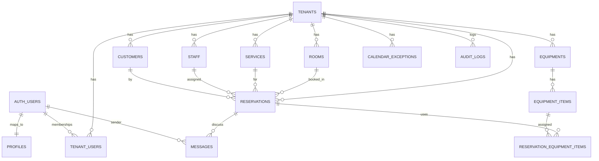
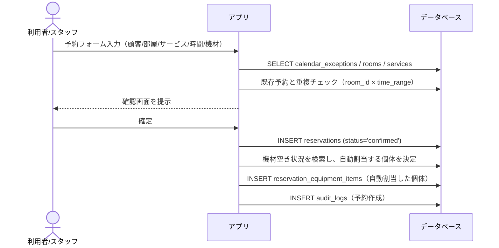

# DB スキーマ概要（PulseBoard）

本ドキュメントは、マルチテナントの予約・機材管理に関するスキーマ全体像と、RLS（Row Level Security）方針、テーブル要約を示します。DDL の正本は `supabase/migrations` 配下の SQL です。

- 参照元
  - コア: `supabase/migrations/0002_core.sql`
  - プロフィール: `docs/db/tables/profiles.md`

---

## RLS 方針（要約）

- 全テーブルで RLS を有効化。
- 共通ヘルパー関数（public）
  - `app_is_tenant_member(tenant uuid)`: ログインユーザーが当該テナントのメンバーか判定
  - `app_is_tenant_admin(tenant uuid)`: 上記に加えて admin か判定
- 基本パターン
  - マスタ系（rooms/services/equipments/equipment_items）は「メンバー参照可／管理者のみ書き込み」。
  - 業務データ（customers/reservations/messages 等）は「メンバー read/write」。
  - 監査（audit_logs）は「admin 参照／メンバー挿入のみ」。

<!-- prettier-ignore-start -->
| テーブル              | select              | insert/update/delete      |
| --------------------- | ------------------- | ------------------------- |
| tenants               | メンバー            | 管理者                    |
| tenant_users          | 管理者 または 本人行参照 | 管理者                |
| rooms/services/equipments/equipment_items | メンバー | 管理者          |
| customers             | メンバー            | メンバー                  |
| staff                 | メンバー            | 管理者                    |
| reservations          | メンバー            | メンバー                  |
| reservation_equipment | 親予約のテナント メンバー | 親予約のテナント メンバー |
| calendar_exceptions   | メンバー            | 管理者                    |
| messages              | メンバー            | メンバー                  |
| audit_logs            | 管理者              | 挿入のみメンバー（更新/削除なし） |
<!-- prettier-ignore-end -->

> 目的: アプリ層の不具合時でも、テナント境界や権限を DB レベルで強制する。

> マルチテナント整合性: 主なテーブルは `(tenant_id, id)` の複合一意制約を持ち、参照側は同じ組で外部キーを張って他テナントとの紐づけを防いでいる。

---

## ER 図（簡略）



> 注: `AUTH_USERS` は Supabase の `auth.users`。Mermaid の簡略表記のため大文字・エイリアスを使用。

---

## テーブル要約

- Tenancy
  - `tenants`: テナント（組織）本体。`slug` は必須の人間可読 ID（小文字英数+ハイフン、3〜50、ユニーク）。
  - `tenant_users`: テナント所属とロール（`admin`/`member`）。PK は `(tenant_id, profile_id)`。
- Master Data
  - `rooms`: 部屋。`open_hours` は曜日別スロット（JSON）。`(tenant_id, id)` で一意。
  - `services`: 提供メニュー。`duration_min` と前後バッファで占有時間を計算。`(tenant_id, id)` で一意。
  - `equipments`: 機材 SKU。在庫数/個体管理フラグ。SKU は `tenant_id` との複合ユニーク、`(tenant_id, id)` も一意。
  - `equipment_items`: 機材個体（シリアル）。`(tenant_id, equipment_id, serial)` と `(tenant_id, id)` で整合性を確保。親 SKU とは複合外部キー。
- Operational
  - `customers`: 顧客。メール・電話は重複許容（ユースケース次第で将来制約）。`(tenant_id, id)` で一意。
  - `staff`: スタッフ。`profile_id` はテナント所属ユーザー必須。`(tenant_id, id)` で一意。
  - `reservations`: 予約。`time_range` 生成列＋ EXCLUDE 制約で「部屋 × 時間帯」の重複を DB で抑止。顧客・サービス・部屋・スタッフとは `(tenant_id, xxx_id)` の複合外部キーでテナント一致を保証。
  - `reservation_equipment_items`: 予約と機材個体の多対多。予約確定時にアプリが空いている個体を自動で選び登録する。個体×時間帯の EXCLUDE 制約で二重貸出を防止し、親予約と同じ `tenant_id` を保持する。
- Exceptions / Logs
  - `calendar_exceptions`: 休業/メンテ/私用などの例外時間帯（scope=tenant/room/equipment/staff）。`target_id` が NULL の場合は scope で指定したカテゴリ全体に適用する。
  - `messages`: 予約に紐づく運用メッセージ。`(tenant_id, reservation_id)` で親予約を参照する。
  - `audit_logs`: 監査ログ（だれが/なにを/いつ）。admin のみ参照。

---

## ユースケースとデータフロー

この章では、実際の業務フローに沿って、各テーブルがどのように連携するかを示します。すべての DB 操作は RLS によりテナント境界・権限が強制されます（メンバー=参照/一部書込、管理者=管理操作）。

### 1) アカウント/テナント初期設定
- サインアップ: `auth.users` に登録 → トリガーで `profiles` を自動作成（role 既定は `member`）。
- テナント作成: 管理者が `tenants` へ INSERT。
- メンバー招待/付与: 管理者が `tenant_users` へ INSERT（`role='member'` または `'admin'`）。

### 2) マスタ設定（店舗・メニュー・機材）
- 部屋: `rooms` へ INSERT。必要に応じて `open_hours` を設定。
- サービス: `services` へ INSERT。`duration_min` と前後バッファを定義。
- 機材: `equipments`（SKU）→ 個体管理が必要なら `equipment_items` にシリアルを登録。

### 3) 予約作成フロー（重複抑止・在庫確認）

- 重複防止: `reservations.time_range` + EXCLUDE 制約で DB が二重予約を抑止。
- 在庫確認: 個体の空き状況を検索し、空き個体を自動選択して `reservation_equipment_items` へ登録。EXCLUDE 制約で DB が同時割当を拒否。

### 4) 予約変更/キャンセル
- 変更: `reservations` を UPDATE。時間帯変更時は EXCLUDE により重複があれば失敗。
- キャンセル: `status='canceled'` に更新 → `time_range` が NULL となり占有解放。
- 付随: `audit_logs` に変更履歴、必要なら `messages` に運用メモ。

### 5) 当日運用（ステータス遷移/メッセージ）
- 推奨遷移: `confirmed` → `in_use` → `completed`（または `no_show`）。
- 進捗・注意点の共有: `messages` にスレッドとして記録。
- 監査: 状態変化/担当変更等は `audit_logs` に追記。

### 6) 例外（休業/メンテ/私用）
- `calendar_exceptions` に対象スコープ（tenant/room/equipment/staff）と時間範囲を登録。
- 予約 UI は例外と重なる時間候補を除外（または警告）。

### 7) テーブル関与マップ（抜粋）
| フロー | 主テーブル | 補助/関連 |
| --- | --- | --- |
| テナント作成/招待 | tenants / tenant_users | profiles, auth.users |
| マスタ登録 | rooms / services / equipments / equipment_items |  |
| 予約作成 | reservations | reservation_equipment_items, customers, staff, audit_logs |
| 予約変更/キャンセル | reservations | messages, audit_logs |
| 例外設定 | calendar_exceptions | rooms/equipments/staff（target_id） |
| 運用メモ/監査 | messages / audit_logs | reservations |

---

## 代表クエリ例（参考）

> クエリは例です。実アプリではパラメータバインド/ビュー/RPC 化を推奨。

1) 指定日の部屋別の空き枠候補（重複除外）
```sql
-- 前提: 対象テナント = :tenant_id, 日付 = :day_start ~ :day_end
select r.id, r.name
from rooms r
where r.tenant_id = :tenant_id and r.active;
-- 空き判定はアプリ層で、reservations の time_range と比較して候補生成
```

2) 予約に紐づく機材個体を取得
```sql
select e.sku, e.name, ei.serial
from reservation_equipment_items rei
join equipment_items ei on ei.id = rei.equipment_item_id
join equipments e on e.id = ei.equipment_id
where rei.reservation_id = :reservation_id;
```

3) 直近の監査ログ
```sql
select action, target_type, target_id, at
from audit_logs
where tenant_id = :tenant_id
order by at desc
limit 50;
```

---

## 運用ルール（ドキュメント）

- 正本: `supabase/migrations/*.sql`（スキーマ変更は必ずマイグレーションで）
- ドキュメント構成
  - 概要: 本ファイル `docs/schema.md`
  - テーブル別詳細: `docs/db/tables/<table>.md`（例: `docs/db/tables/profiles.md`）
  - 変更履歴（任意）: `docs/db/CHANGELOG.md` または PR タイトルに `[db]` プレフィックスを付与
- 更新フロー（PR チェックリスト例）
  - [ ] マイグレーション追加/更新
  - [ ] SQL 内コメント（`-- JP:` など）の更新
  - [ ] `docs/schema.md` の要約更新
  - [ ] 影響テーブルの `docs/db/tables/<table>.md` 更新/新規作成
- 将来の自動化（任意）
  - `COMMENT ON TABLE/COLUMN` を併用し、`psql` やスクリプトでメタデータを Markdown に生成
  - Mermaid ER 図もスクリプトで再生成（テーブル/外部キー抽出 → テキスト化）

---

## 参考

- 認証・プロフィール: `docs/db/tables/profiles.md`
- コア DDL: `supabase/migrations/0002_core.sql`

---

## テーブル別詳細

- `docs/db/tables/profiles.md`
- `docs/db/tables/tenants.md`
- `docs/db/tables/tenant_users.md`
- `docs/db/tables/rooms.md`
- `docs/db/tables/services.md`
- `docs/db/tables/equipments.md`
- `docs/db/tables/equipment_items.md`
- `docs/db/tables/customers.md`
- `docs/db/tables/staff.md`
- `docs/db/tables/reservations.md`
- `docs/db/tables/reservation_equipment_items.md`
- `docs/db/tables/calendar_exceptions.md`
- `docs/db/tables/messages.md`
- `docs/db/tables/audit_logs.md`
