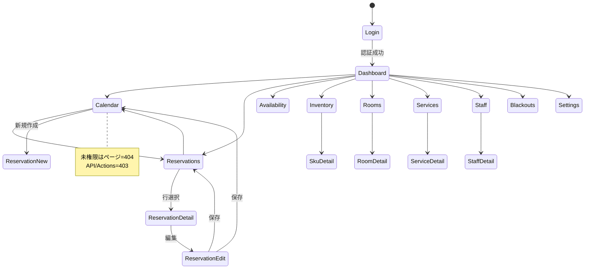

# 画面遷移概要

本ページは主要画面と遷移の俯瞰図を提供します。

UI 実装は Next.js App Router（/t/:slug 配下）を前提とします。

## 0. ポリシー

- 直リンク可能: すべての画面は `/t/:slug/...` で直リンク/リロード可能
- 認可: ページは未権限=404（秘匿）、API/Actions は未権限=403（要件 2 章, 9.1.1）
- テナント切替: ヘッダーのスイッチャーで Cookie とパスを同期（`/t/:slug` へ）

## 1. 主要画面（案）

- `/login`（未認証時）
- `/t/:slug` ダッシュボード
- `/t/:slug/reservations` 予約一覧
- `/t/:slug/reservations/calendar` カレンダー（`?view=week|day`）
- `/t/:slug/reservations/new` 予約作成（モーダル/ドロワーでも可）
- `/t/:slug/reservations/:id` 予約詳細（TBD: ドロワー連携、要件 15.1）
- `/t/:slug/availability` 可用枠検索（条件パネル＋結果）
- `/t/:slug/inventory` 機材（SKU 一覧）
- `/t/:slug/inventory/:sku` SKU 詳細（個体割当は返却時）
- `/t/:slug/rooms` 部屋一覧
- `/t/:slug/services` サービス一覧
- `/t/:slug/staff` スタッフ一覧
- `/t/:slug/blackouts` 例外日管理
- `/t/:slug/settings` 設定（営業時間/色/バッファ等）

## 2. 遷移図（stateDiagram）

補足:

- 予約詳細 URL とドロワーの整合は `docs/requirements.md` 15.1 の検討事項。
- 深いリンク（例: `/t/abc/reservations/calendar?reservationId=...`）は表示上の連携に留め、参照不可能な ID は 404 秘匿で扱う。

---

## 3. トレーサビリティ

- 要件 2 章（ロール/RBAC）、7 章（競合/可用枠）、9.1.1（認証・権限の HTTP 規約）
- E2E（S1）カバー対象: 予約 CRUD、可用枠検索、ロール別アクセス
