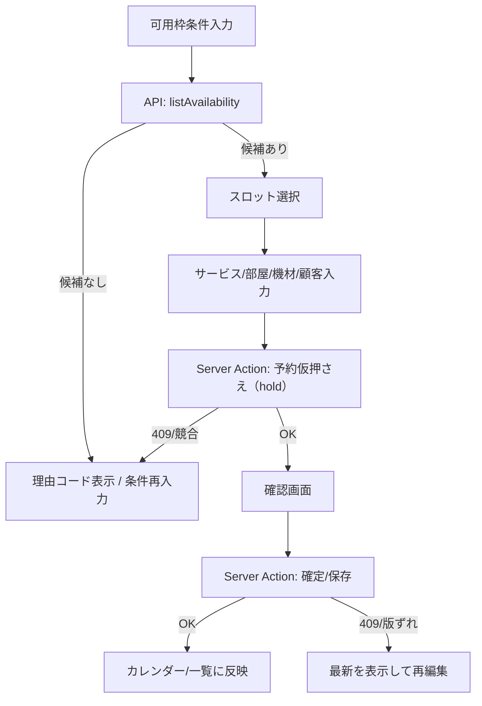

# ユースケース一覧 & 図

本ページは主要ユースケースの要約と図を提供します。詳細ルールは `docs/requirements.md` を参照してください。

## 0. 前提/記法

- Actor: `admin`（管理者）, `member`（一般メンバー）
- すべて `/t/:slug/...` 配下。未認証 →`/login`、未権限ページ=404、API/Actions=403（要件 2 章, 9.1.1）
- 予約競合/可用枠は v1 ロジック（要件 7 章）を適用

## 1. 一覧（要約）

- UC-01 予約作成（admin/member）: 可用枠を検索 → スロット選択 → サービス/部屋/機材入力 → 仮押さえ → 確定
- UC-02 予約編集/リスケ（admin/member）: 日時・部屋・機材変更 → 競合再判定 → 確定
- UC-03 予約キャンセル（admin/member）: 状態を `canceled` に遷移（料金規定は v1 表示のみ）
- UC-04 担当者割当（admin/member）: 予約にスタッフを割当/変更（任意）
- UC-05 可用枠検索（admin/member）: 期間/サービス/条件指定 → 候補 n≤50 を取得
- UC-06 ブラックアウト登録（admin）: 店舗/部屋/機材/スタッフの例外日を登録
- UC-07 機材 SKU/個体管理（admin）: SKU CRUD、個体のステータス変更
- UC-08 部屋/サービス管理（admin）: 営業時間/色/バッファ/所要時間の設定
- UC-09 スタッフ管理（admin）: スタッフ CRUD、スキル管理
- UC-10 認証/テナント切替（admin/member）: サインイン、ヘッダーのテナントスイッチャー
- UC-11 監査/ログ参照（admin/member）: 予約の履歴・内部メモ・相関 ID 参照

---

## 2. フロー図（予約作成/確定）

補足:

- 競合は要件 7 章の順序で判定（営業時間 → 例外日 → 部屋 → 機材 → 任意スタッフ）。
- 保存時は `If-Match` による楽観制御、重複/版ずれは 409 で扱う（要件 9.1）。

---

## 3. トレーサビリティ

- 要件 3 章/5 章/7 章（ユースケース・例外日・競合/可用枠）
- 要件 9.1/9.1.1（API/エラー規約、認証・権限の HTTP 規約）
- 受け入れ（S1）と E2E: 予約 CRUD／可用枠検索／ロール別アクセス
